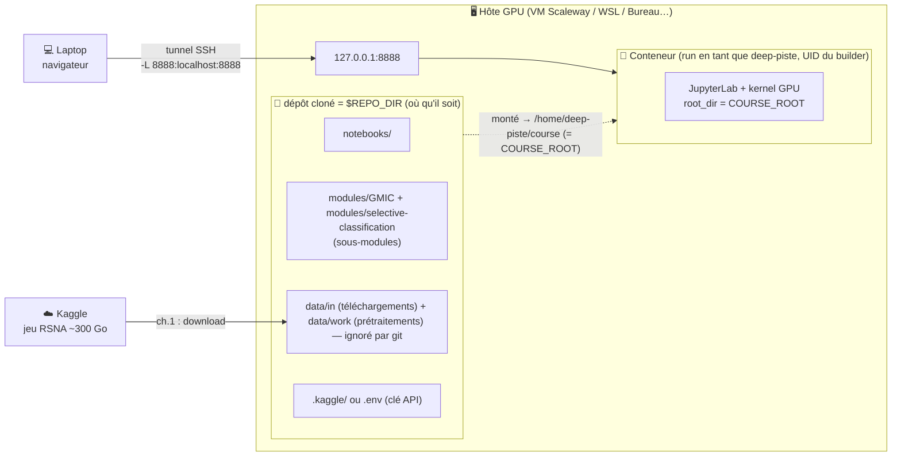

# Breast Cancer Course — Deep Learning sur mammographies

Cours pratique en 6 chapitres, du PyTorch de base jusqu'au **contrôle de risque
garanti** (abstention / selective classification), appliqué à la détection du
cancer du sein sur mammographies (jeu de données **RSNA**).

Chaque chapitre est un **notebook Jupyter qui exécute réellement du code** : il
entraîne de vrais réseaux, télécharge des jeux de données, et reproduit les
résultats. L'environnement GPU complet est packagé dans une **image Docker** qui ne
contient *que* cet environnement. Le **dépôt entier est monté en volume** dans le
conteneur au runtime : JupyterLab affiche donc exactement l'arborescence du dépôt
cloné — peu importe où il a été cloné (Bureau, WSL, VM…), **aucun chemin n'est codé
en dur**. Les deux dépôts externes utilisés (`GMIC` et `selective-classification`)
sont des **sous-modules git** (dossier `modules/`) : un `git clone --recurse-submodules`
les récupère, et comme ils sont montés (pas copiés), les mettre à jour ne demande
aucun rebuild.

---

## Architecture



Le kernel (donc les entraînements) tourne **dans le conteneur, sur le GPU de l'hôte**.
Le tunnel SSH ne transporte que l'interface web. **Un seul montage** : le dépôt cloné
→ `COURSE_ROOT` dans le conteneur. Notebooks, sous-modules et données suivent donc le
dépôt, et l'explorateur JupyterLab montre exactement son arborescence. L'image ne
contient que l'environnement Python/CUDA.

---

## Les chapitres

| # | Notebook | Sujet | GPU |
|---|----------|-------|-----|
| 1 | `notebooks/01_download_data.ipynb` | **Télécharger les données RSNA via la clé Kaggle** (prérequis aux ch. 2.5→5) | non |
| 2 | `notebooks/02_pytorch_basics.ipynb` | PyTorch de base : tenseurs, autograd, un réseau de vision simple | non (CPU OK) |
| 2.5 | `notebooks/02.5_preprocessing.ipynb` | Pré-traitement des mammographies : DICOM → PNG, crop, conversions qui libèrent le CPU (ne laisser que le décodage) | recommandé |
| 3 | `notebooks/03_resnet18_breast_density.ipynb` | Entraînement multiclasse avec un réseau connu (ResNet-18) — cas d'usage : **densité mammaire** | oui |
| 4 | `notebooks/04_gmic_architecture.ipynb` | Architecture d'un réseau récent : **GMIC** (ensemble de réseaux) — cas d'usage : **cancer malin RSNA** | oui |
| 5 | `notebooks/05_gmic_finetuning.ipynb` | Fine-tuning de GMIC sur RSNA | oui |
| 6 | `notebooks/06_risk_control_abstention.ipynb` | **Risques garantis** (selective classification, papier Beyond Accuracy) et comment appliquer ces fonctions | non (CPU OK) |

> Le chapitre 2 et le chapitre 6 peuvent tourner sur une machine sans GPU
> puissant. Les chapitres 2.5 à 5 supposent un GPU NVIDIA (entraînements réels).

---

## Prérequis (à régler **avant** de construire l'image)

1. **Une machine avec un GPU NVIDIA** + pilotes, `docker`, et le
   `nvidia-container-toolkit` (pour `docker run --gpus all`).
2. **Accès au démon Docker** : votre utilisateur doit pouvoir lancer `docker`
   (membre du groupe `docker`, ou `sudo docker`, ou Docker rootless).
3. **Une clé d'API Kaggle** (pour télécharger le jeu RSNA). Voir
   [Configuration Kaggle](#configuration-kaggle) — c'est la chose à ne pas
   oublier sinon les notebooks de téléchargement échoueront.

Les données RSNA (~300 Go) ne sont **jamais** dans l'image : elles sont
téléchargées par les notebooks dans `data/` **à la racine du dépôt** (ignoré par
git), donc elles persistent entre deux `docker run`. Convention : `data/in/` pour les
**entrées brutes** (téléchargements) et `data/work/` pour les **sorties produites**
(prétraitements, crops, checkpoints).

---

## Démarrage rapide

```bash
# 1. Cloner ce dépôt AVEC ses sous-modules (GMIC + selective-classification)
git clone --recurse-submodules git@github.com:Epiconcept-Paris/data-capsule-deep-piste.git
cd data-capsule-deep-piste
# (si déjà cloné sans --recurse-submodules :)
git submodule update --init --recursive

# 2. Configurer Kaggle (voir section dédiée) — une seule fois
#    => place kaggle.json dans .kaggle/ à la racine du dépôt (ou renseigne .env)

# 3. Construire l'image (env GPU + deps via uv ; reprend l'UID/GID de l'utilisateur courant)
./docker-build.sh          # docker build --build-arg HOST_UID=... --build-arg HOST_GID=... -t ...

# 4. Lancer JupyterLab dans le conteneur (GPU + volumes montés)
./docker-run.sh            # écoute sur 127.0.0.1:8888 DANS la VM

# 5. Depuis votre laptop, ouvrir un tunnel SSH vers la VM puis le navigateur
ssh -L 8888:localhost:8888 <votre-alias-vm>
#    puis ouvrir http://localhost:8888 dans le navigateur du laptop
```

Le kernel Jupyter (donc les entraînements) s'exécute **dans le conteneur sur la
VM**, avec le GPU. Le tunnel SSH ne transporte que l'interface web.

Une fois dans JupyterLab, commencez par **`notebooks/01_download_data.ipynb`**
pour récupérer le jeu RSNA via la clé Kaggle, puis suivez les chapitres dans
l'ordre.

---

## Configuration Kaggle

Les notebooks téléchargent le jeu RSNA via l'API Kaggle. Les identifiants se placent
**à la racine du dépôt** (jamais dans l'image, et ignorés par git), montés en lecture
seule dans le conteneur.

1. Sur [kaggle.com](https://www.kaggle.com) → *Account* → *Create New API Token*
   → télécharge `kaggle.json`.
2. À la racine du dépôt cloné :
   ```bash
   mkdir -p .kaggle
   mv ~/Downloads/kaggle.json .kaggle/kaggle.json
   chmod 600 .kaggle/kaggle.json
   ```
3. `docker-run.sh` monte `<dépôt>/.kaggle` → `~/.kaggle` dans le conteneur automatiquement.

Vous pouvez aussi copier `.env.example` en `.env` (à la racine du dépôt) et y mettre
`KAGGLE_USERNAME`/`KAGGLE_KEY` (lus au `docker run` via `--env-file`).

---

## Ce que fait l'image Docker

- Base : `pytorch/pytorch:2.4.1-cuda12.1-cudnn9-runtime` (même stack torch que la VM).
- Installe les dépendances Python des 6 chapitres avec **`uv`** (déclarées dans `pyproject.toml`).
- Crée un utilisateur non-root **avec l'UID/GID de celui qui build** (`--build-arg
  HOST_UID/HOST_GID`, posés par `docker-build.sh`) : les fichiers écrits dans le dépôt
  monté lui appartiennent, pas à `root`.
- Démarre JupyterLab sur le port 8888, `root_dir = COURSE_ROOT`.

L'image **ne contient que l'environnement** (ni données, ni sous-modules, ni notebooks).
`docker-run.sh` initialise les sous-modules s'ils manquent, puis fait **un seul montage** —
le dépôt entier — plus les identifiants Kaggle :

| Hôte | Conteneur | Rôle |
|------|-----------|------|
| `<dépôt>` (= `$REPO_DIR`) | `/home/deep-piste/course` (= `COURSE_ROOT`) | tout le cours : `notebooks/`, `modules/GMIC` + `modules/selective-classification`, `data/` |
| `<dépôt>/.kaggle` | `/home/deep-piste/.kaggle` (ro) | identifiants Kaggle (sinon `.env` via `--env-file`) |

Comme tout vit sous `COURSE_ROOT`, les notebooks ne référencent **aucun chemin en
dur** : ils passent par `course_utils.course_root()` (qui lit `COURSE_ROOT`), d'où
`modules/GMIC`, `modules/selective-classification` et `data/`.

---

## Structure du dépôt

```
data-capsule-deep-piste/
├── README.md              # ce fichier
├── Dockerfile             # image GPU + deps Python via uv (sous-modules montés au runtime)
├── pyproject.toml         # dépendances Python des 6 chapitres (installées via uv)
├── docker-build.sh        # construit l'image
├── docker-run.sh          # lance JupyterLab (GPU + volumes)
├── .env.example           # gabarit pour les identifiants Kaggle
├── .gitmodules            # déclare les 2 sous-modules
├── data/                  # données — vide dans git, contenu ignoré (data/.gitignore)
│   ├── in/                #   entrées brutes téléchargées (RSNA, échantillon, CIFAR)
│   └── work/              #   sorties produites (prétraitements, crops, checkpoints)
├── modules/               # sous-modules git
│   ├── GMIC/              #   → nyukat/GMIC (+ 5 poids pré-entraînés)
│   └── selective-classification/   # → EmilienJemelen/selective-classification
└── notebooks/             # les 6 chapitres + course_utils.py (helpers, dont course_root())
```
